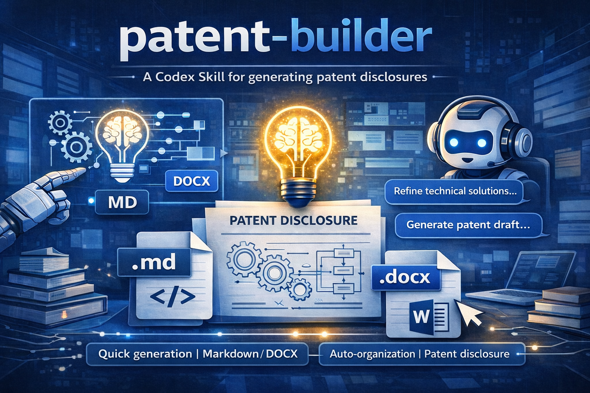

<div align="center">

# patent-builder

### 一个用于生成专利技术交底书的 Codex Skill

**中文** | [English](./docs/README.en.md)

</div>



`patent-builder` 不是一个独立应用，而是一个可被 agent 安装和调用的 skill。

它的目标很直接：让你把零散的技术想法快速整理成一份结构化的专利技术交底书，并按需要输出为 `Markdown` 或 `DOCX`。


## 这个 skill 能做什么

- 通过对话收敛技术方案，生成专利交底书草稿
- 支持最终输出为 `markdown` 或 `docx`
- 自带默认交底模板
- 支持把已有 Markdown 继续导出为 `.docx`
- 适用于方法、系统、装置、结构、材料、工艺、控制、算法等通用交底场景

## 安装方式

如果你在用 `Cursor`、`Codex`、`OpenClaw` 或其他支持 skill / agent workflow 的工具，最简单的方式不是手动搬文件，而是把这个项目的**本地路径**或**仓库 URL**直接发给 agent，让它帮你安装。

### 方式 1：用本地路径安装

把项目路径发给 agent，例如：

```text
Please install this skill from the local project path:
/path/to/patent-builder
```

如果你就在当前机器上，也可以直接给出实际路径：

```text
Please install this skill from:
/Users/yangchaoqun/Desktop/专利/patent-builder
```

### 方式 2：用仓库 URL 安装

如果这个项目已经放到 Git 仓库里，直接把仓库地址发给 agent，例如：

```text
Please install the skill from this repository URL:
<your-repo-url>
```

### 推荐你直接对 agent 这样说

```text
Install the skill from this project and make it available in my skills list.
Use the skill name defined in the repo and finish the setup automatically.
```

## 怎么使用

安装完成后，你可以直接让 agent 调用这个 skill 来生成交底书。典型用法很简单：

1. 先告诉 agent 你要输出 `markdown` 还是 `docx`
2. 再告诉它你的技术方案、目标、关键对象和约束
3. 让它基于这个 skill 生成交底书草稿
4. 如果你要 Word 文件，再让它导出成 `.docx`

例如：

```text
Use patent-builder to draft a patent disclosure for my idea.
Final output format: docx.
```

或者中文：

```text
请使用 patent-builder 这个 skill 帮我生成一份专利技术交底书。
最终输出格式为 docx。
```

## 仓库内容

- [patent-disclosure-from-docx/SKILL.md](/Users/yangchaoqun/Desktop/专利/patent-builder/patent-disclosure-from-docx/SKILL.md)：skill 定义文件
- [patent-disclosure-from-docx/agents/openai.yaml](/Users/yangchaoqun/Desktop/专利/patent-builder/patent-disclosure-from-docx/agents/openai.yaml)：agent 配置
- [patent-disclosure-from-docx/references/default-disclosure-template.md](/Users/yangchaoqun/Desktop/专利/patent-builder/patent-disclosure-from-docx/references/default-disclosure-template.md)：默认交底模板
- [patent-disclosure-from-docx/scripts/markdown_to_docx.py](/Users/yangchaoqun/Desktop/专利/patent-builder/patent-disclosure-from-docx/scripts/markdown_to_docx.py)：Markdown 转 DOCX 脚本

## 环境要求

- Python 3
- 无第三方依赖

## 一句话说明

如果你想要的不是一套复杂系统，而是一个能被 agent 直接安装、直接调用、直接产出专利交底书的 skill，这个仓库就是为这个目的准备的。
